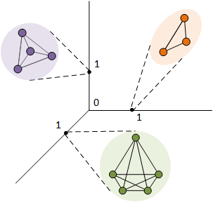

## Lovász Convolutional Networks

Source code for [AISTATS 2019](https://www.aistats.org/) paper: [Lovász Convolutional Networks](https://arxiv.org/abs/1805.11365).



### Dependencies

- Compatible with TensorFlow 1.x and Python 3.x.
- Dependencies can be installed using `requirements.txt`.

### Dataset:

- The current code allows evaluation on synthetic datasets which can be downloaded from [here](https://drive.google.com/open?id=1dZY9cx6poEjzyPAlI194TklzwrC3-ORr).

### Evaluate pretrained model:

- Run `setup.sh` for setting up the environment and extracting the datasets and pre-trained models.
- `lcn.py` contains TensorFlow (1.x) based implementation of **LCN** (proposed method).
- Execute `evaluate.sh` for evaluating pre-trained **LCN** model on all four datasets.

### Training from scratch:

- Execute `setup.sh` for setting up the environment and extracting datasets. 

- For training **LCN** run:

  ```shell
  python lcn.py -data citeseer -name new_run -kernel <lovasz/kls/none>
  ```

### Citation
Please cite us if you use this code.

```tex
@InProceedings{yadav19a,
  title = 	 {Lovasz Convolutional Networks},
  author = 	 {Yadav, Prateek and Nimishakavi, Madhav and Yadati, Naganand and Vashishth, Shikhar and Rajkumar, Arun and Talukdar, Partha},
  booktitle = 	 {Proceedings of Machine Learning Research},
  pages = 	 {1978--1987},
  year = 	 {2019},
  editor = 	 {Chaudhuri, Kamalika and Sugiyama, Masashi},
  volume = 	 {89},
  series = 	 {Proceedings of Machine Learning Research},
  address = 	 {},
  month = 	 {16--18 Apr},
  publisher = 	 {PMLR},
  pdf = 	 {http://proceedings.mlr.press/v89/yadav19a/yadav19a.pdf},
  url = 	 {http://proceedings.mlr.press/v89/yadav19a.html}
}
```

For any clarification, comments, or suggestions please create an issue or contact [prateekyadav@iisc.ac.in](mailto:prateekyadav@iisc.ac.in).
